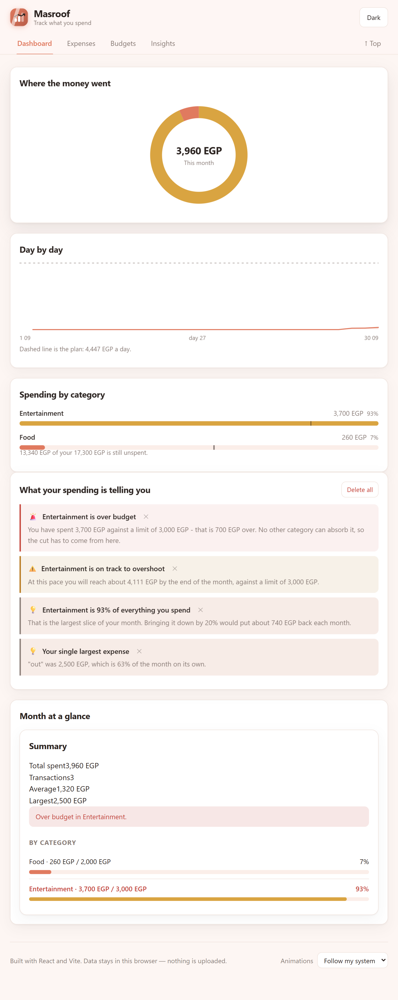
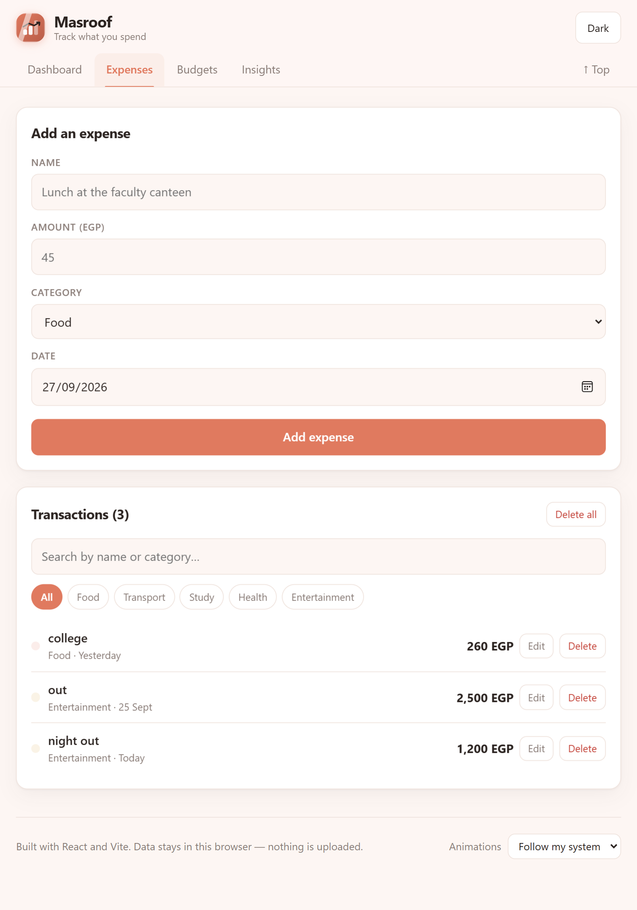
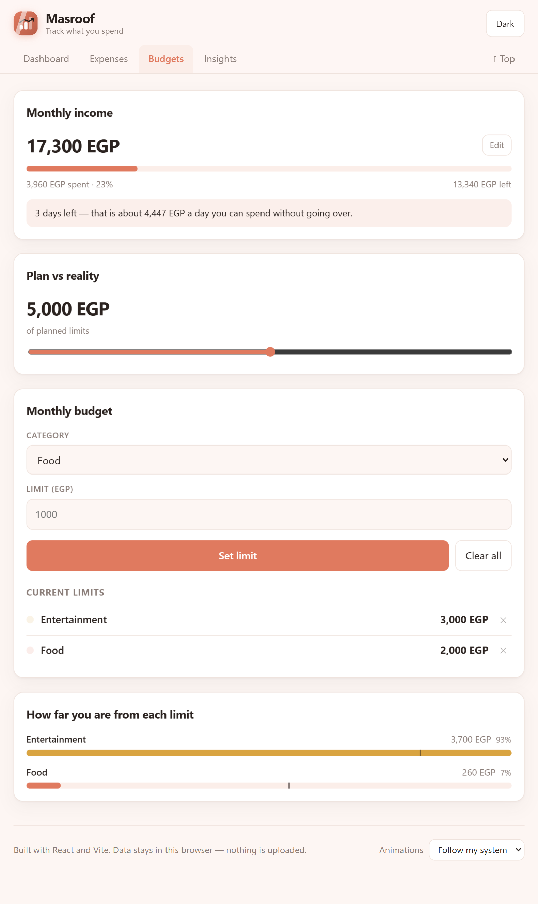
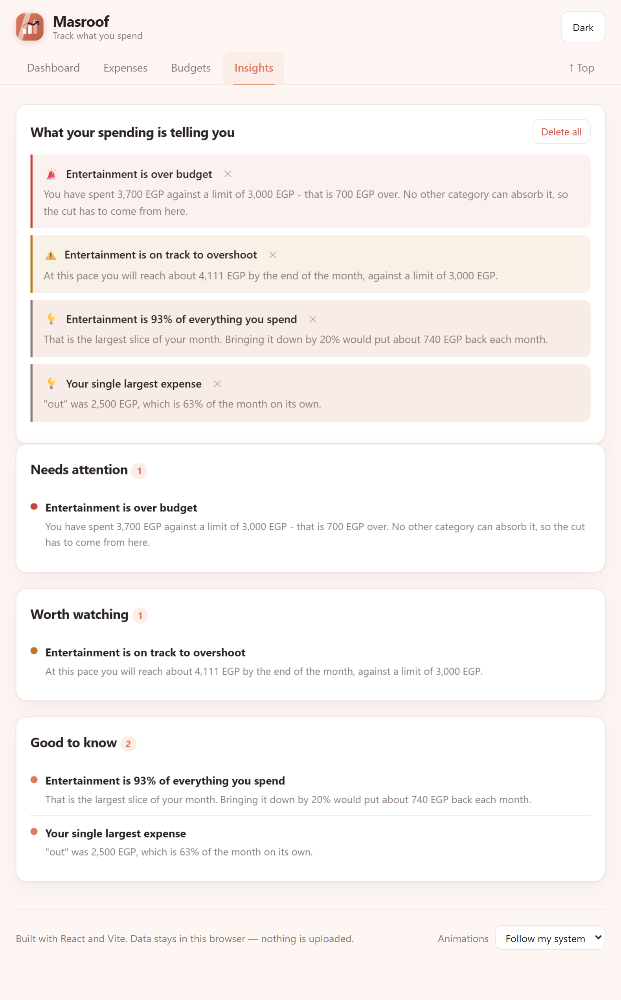

# Masroof

**Live demo → [masroof.netlify.app](https://masroof.netlify.app)**

A spending tracker that tells you what to do before you run out of money. Add
your expenses, set a limit per category, and the app reads the numbers back to
you in plain language.

No account, no backend. Everything stays in the browser.



---

## Overview

Most expense trackers are a table and a total. The part that is actually hard is
the advice: is this month fine, or is it already too late? Masroof takes
expenses, a budget per category, and a monthly income, then produces a small set
of concrete warnings — over budget, on track to overshoot, one category eating
the month, spending above income, and what is safe to spend per day for the rest
of the month.

Everything is written in plain English on purpose. The insights are the product,
not the chart.

## Features

**Expenses**
- Add, edit and delete expenses with title, amount, date and category
- Filter by category, search by name
- Validation with inline errors, focus moved to the first problem, and a shake
- Clear all with a confirmation step

**Budgets**
- A monthly limit per category, including limits on your own category names
- Per-limit delete, plus clear all
- The bar turns red once you are over

**Insights**
- Over budget, and by how much
- On track to overshoot, projected to the end of the month
- One category taking more than a third of the total
- Spending above your monthly income
- Safe daily spend for the rest of the month
- Dismiss one insight or clear them all; dismissed ones stay gone

**Interface**
- Four views: Dashboard, Expenses, Budgets, Insights, with deep links (`#/budgets`)
- Charts with no chart library: donut, category bars with limit markers, and a
  day-by-day cumulative line with a dashed pace line
- Light and dark themes, remembered between visits
- Responsive from 320px up
- Scroll reveal and soft parallax, both respecting reduced motion

## Tech stack

| | |
|---|---|
| React 18 | hooks only, no classes |
| Vite 6 | build and dev server |
| CSS | custom properties, no framework |
| State | React Context, three providers |
| Charts | hand-written SVG |
| Storage | `localStorage` behind one hook |
| Dependencies in `package.json` | `react`, `react-dom`. That is it. |

## Screenshots

| Expenses | Budgets |
|---|---|
|  |  |

| Insights | Dark mode |
|---|---|
|  |  |

## Architecture

```
src/
  main.jsx                  provider order: preferences > data > categories
  App.jsx                   layout, routing, theme
  data.js                   default categories, palette, colour from name
  insights.js               every spending rule, pure functions
  context/
    PreferencesContext.jsx  theme and motion preference
    DataContext.jsx         transactions, budget, income + all mutations
    CategoriesContext.jsx   the five default categories
  hooks/
    useLocalStorage.js      persistence
    useInView.js            IntersectionObserver, used by two components
    useHashRoute.js         routing on window.location.hash
    useMotion.js            reduced-motion handling
    Soft.jsx                reveal then scroll-linked parallax
  components/
    charts/                 DonutChart, CategoryBars, DailyTrend
    states.jsx              empty, no results, error, skeleton
    TransactionForm.jsx     add and edit
    TransactionList.jsx     list, search, filter
    BudgetPanel.jsx         limits
    InsightsPanel.jsx       insights with dismiss
    Reveal.jsx              per-item reveal
    Header.jsx              brand, theme, navigation
    Logo.jsx                inline SVG
  views/
    Dashboard.jsx           charts and summary
    Expenses.jsx            form and list
    Budgets.jsx             income, limits, comparison
    Insights.jsx            grouped rules
```

### Data flow

`DataContext` is the only place data changes. Views never call `setState` on
transactions directly, they call the actions it exposes:

```
addTransaction  updateTransaction  deleteTransaction  deleteAllTransactions
setBudgetLimit  deleteBudgetLimit  clearBudget  setIncome
```

`insights.js` is a pure function of `(transactions, budget, month, income,
categories)`. It has no React in it, which is why the same rules can be reused by
the Gemini advisor that is not wired up yet, and why they are easy to reason
about.

## Decisions and challenges

**No chart library.** Recharts is 100 kB+ and a lot more than three small
charts. The donut is a single circle with `stroke-dasharray`, the bars are
divs, and the day-by-day line is a path built from cumulative sums. Total
bundle is 58 kB gzipped for the whole app.

**Custom categories that do not pollute the list.** Picking `Other` lets you type
a name. The name is stored on that expense only, so you can log "Haircut" once
without "Haircut" appearing in the dropdown for the rest of your life. Names that
exist in your data get a colour derived from the name itself, so the same
category is always the same colour.

**The old localStorage keys were renamed.** The app moved from `expense-tracker-*`
to `masroof-*`. `DataProvider` migrates the old values on first load and only
then clears the old keys, so nothing is lost and a refresh cannot break it.

**The scroll animation took two attempts.** The first version used a CSS
transition to drive a value that JavaScript was also writing, which made
everything feel like jelly. The fix was a `ready` class that removes the
transition once the reveal has finished, so the scroll handler can write
`transform` directly with no smoothing in the way. Scroll work is
`requestAnimationFrame`-throttled and the listeners are passive.

**Animations are not decoration.** Every animation here either shows where
something came from or confirms something happened. There is a motion setting
in the footer, and `prefers-reduced-motion` is respected regardless of what that
setting says — the OS setting wins.

**Colour is derived, not stored.** A custom category name is hashed into a
ten-colour palette, so it always gets a stable colour and never collides with a
neighbour's.

## Accessibility

- Skip link, labelled navigation, `aria-current` on the active tab
- Every interactive element reachable and visible on keyboard focus
- Icon-only buttons carry `aria-label` and `title`
- Form errors are text, not just a red border, and focus moves to the first one
- `prefers-reduced-motion` disables animation, and an in-app setting can
  override it either way

## Running it

```bash
npm install
npm run dev
```

```bash
npm run build      # production build into dist/
npm run preview    # serve the build locally
```

On Windows, `start.bat` installs nothing but starts the dev server and opens the
browser.

## Deploying

The build output is a static `dist/` folder, so any static host works.
`vercel.json` and `public/_redirects` are already set up for Vercel and Netlify.

## Notes

- The Gemini advisor is not enabled. The code is in `src/services/` and needs
  `VITE_GEMINI_API_KEY` in `.env.local` if you want to bring it back. `.env*` is
  gitignored, `.env.example` is not.
- `src/advisor.css` is only the stylesheet for that unfinished feature.
